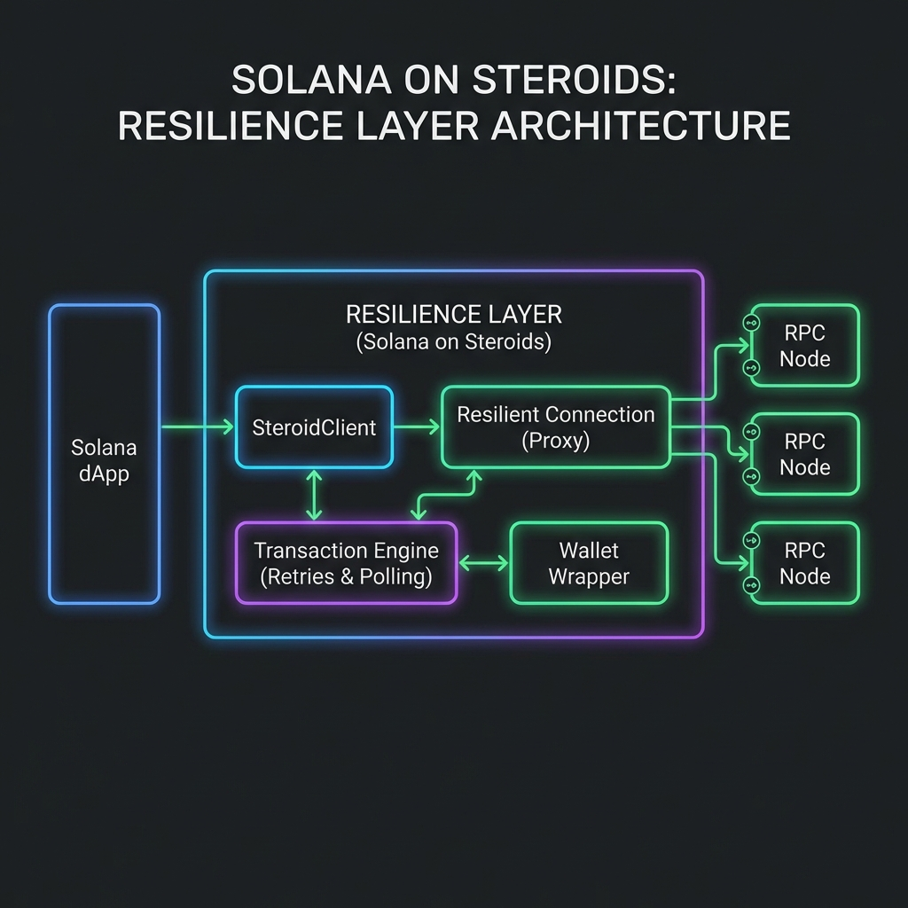
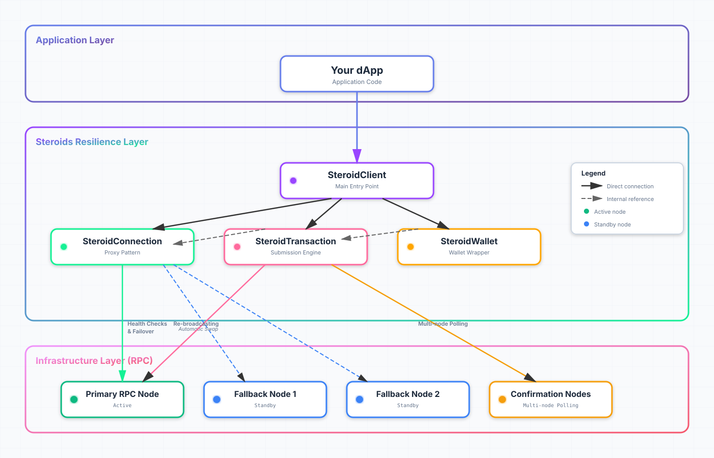

# Solana Resilience ⚙️🧱

**A systems-grade resilience layer for `@solana/web3.js`**

Solana UX today is fragile: wallet adapters leak abstractions, RPC behavior is inconsistent, and many integrations fall short of production-grade reliability. **Solana Resilience** treats crypto UX correctness as a systems problem, making network instability and RPC variability invisible to your users.

[](https://www.npmjs.com/package/solana-resilience)
[](https://opensource.org/licenses/MIT)
[](https://www.typescriptlang.org/)

---

## 🌩 The Problem: The "Fragile UX" Trap

Standard Solana dApps often suffer from:
- **Node Lag**: Node A says "confirmed," but Node B (used by the app) says "not found."
- **Ghost Transactions**: Transactions dropped during congestion with no clear recovery path.
- **RPC Single-Point-of-Failure**: If your primary RPC provider hiccups, your entire app freezes.
- **Cryptic Errors**: Raw hex logs and "Simulation failed" messages that confuse users.

## 💊 The Solution: Systems-Grade Resilience

This library wraps `@solana/web3.js` in a robust, automated engine that handles the edge cases of a high-performance blockchain.

### 1. Transparent RPC Failover (Proxy Pattern)
Uses a JS `Proxy` to wrap the `Connection` object. If a node failure (5xx, network error) is detected, it automatically swaps to a healthy fallback node mid-request. **Your app code stays "dumb" while the infra stays smart.**

### 2. Low-Latency WebSocket Confirmation (v1.0.13)
Now prioritizes `onSignature` WebSocket subscriptions for real-time confirmation. It offers ultra-low latency compared to polling, while maintaining a robust multi-node HTTP fallback if the WebSocket connection is unstable.

### 3. Automatic Cluster Detection & Safety
Automatically identifies the Solana network (Mainnet, Devnet, Testnet) via genesis hash. Prevents catastrophic "cross-network" mistakes by validating that your wallet and RPC connection are targeting the same cluster.

### 4. Multi-Node Confirmation Polling (Fallback)
Doesn't trust a single node's word. If WebSockets fail or time out, it polls multiple RPC providers simultaneously for signature status to bypass node lag.

### 5. Continuous Re-broadcasting Loop
Transactions are "babysat" by an engine that refreshes blockhashes and re-broadcasts automatically until a definitive landing or expiration occurs.

### 6. Dynamic Priority Fee Optimization
Automatically measures compute unit consumption via simulation and fetches network-wide priority fee percentiles to inject optimal `ComputeBudget` instructions.

---

## 🗺 Architecture Overview



### Technical Resilience Flow


---

## 🚀 Key Features

### 1. Transparent RPC Failover & Latency Scoring
Uses a JS `Proxy` to wrap the `Connection` object. It tracks **Exponential Moving Average (EMA)** latency, success rates, and **Slot Lag** for all RPC nodes, automatically selecting the healthiest and fastest performer.

### 2. Concurrent Race Strategy (Adaptive)
When nodes fail or underperform, the engine can concurrently race requests against the top $N$ healthy nodes, returning the fastest result to minimize latency spikes during failovers.

### 3. Automatic Cluster Safety Guards
Identifies the cluster (Mainnet, Devnet, Testnet) via genesis hash on initialization. It prevents "cross-network" accidents by validating the wallet network against the RPC target.

### 4. Smart Transaction "Babysitting"
The engine handles the entire lifecycle:
- **Simulation**: Pre-calculates CUs.
- **Optimization**: Injects optimal priority fees.
- **Persistence**: Re-fetches blockhashes and re-signs if the transaction ages out.

---

## 📦 Installation

```bash
npm install solana-resilience
```

## 🛠 Quick Start

```typescript
import { SteroidClient } from 'solana-resilience';

const client = new SteroidClient('https://api.mainnet-beta.solana.com', {
  connection: {
    fallbacks: ['https://solana-mainnet.rpc.extrnode.com'],
    latencyScoring: true,
    raceNodes: 2,
    maxSlotLag: 50,
    expectedCluster: 'mainnet-beta',
  },
  enableLogging: true,
});

// Use it exactly like a standard @solana/web3.js Connection
const balance = await client.connection.getBalance(myPublicKey);

// Connect a wallet for enhanced transactions
const steroidWallet = client.connectWallet(walletAdapter);

// Listen to the heartbeat of your infra
client.on('connection:failover', ({ from, to, reason }) => {
  console.warn(`Swapping nodes: ${reason}`);
});

client.on('transaction:confirmed', ({ signature, durationMs }) => {
  console.log(`Landed in ${durationMs}ms! 🚀`);
});

// Send with one configuration, the engine does the rest
const signature = await steroidWallet.signAndSend(transaction, {
  computeBudget: { feePercentile: 75 },
  useWebSocket: true // Fastest path with resilient fallback, default: true.
});
```

## 🧬 Core Architecture

### `SteroidConnection`
A resilient proxy for `web3.js.Connection`.
- **Health Heartbeat**: Background pings monitor latency, uptime, and **Slot Lag** across all fallbacks.
- **Concurrent Racing**: Optional parallel request execution to neutralize node-specific latency spikes.
- **Circuit Breaker**: Automatic cooldown periods for unstable nodes to prevent retry-loop fatigue.
- **Cluster Awareness**: Automatic genesis hash validation and cluster mismatch protection.
- **Error classification**: Distinguishes between **Transient** errors and **Node Failures**.

### `SteroidTransaction`
The heavy-duty engine for submission and confirmation.
- **WebSocket Engine**: Real-time push notifications for transaction confirmation.
- **Signature Polling**: Multi-node parallel checks as a resilient fallback.
- **Blockhash Refresh**: Automatically re-fetches `recentBlockhash` if needed.

---

## 📜 License

MIT License. See [LICENSE](LICENSE) for details.

## 🤝 Contributing

We treat reliability as a first-class citizen. If you find an edge case where a transaction could be lost or an RPC error could be better handled, please open an issue or PR.
